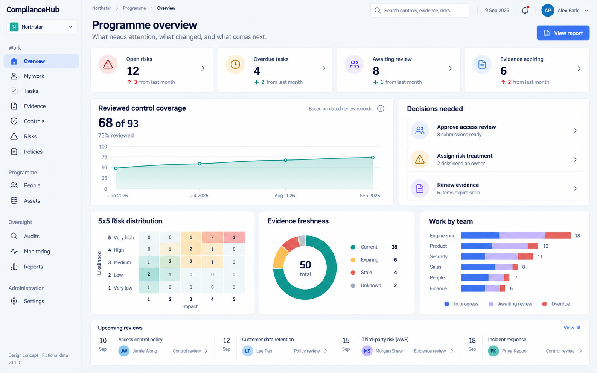
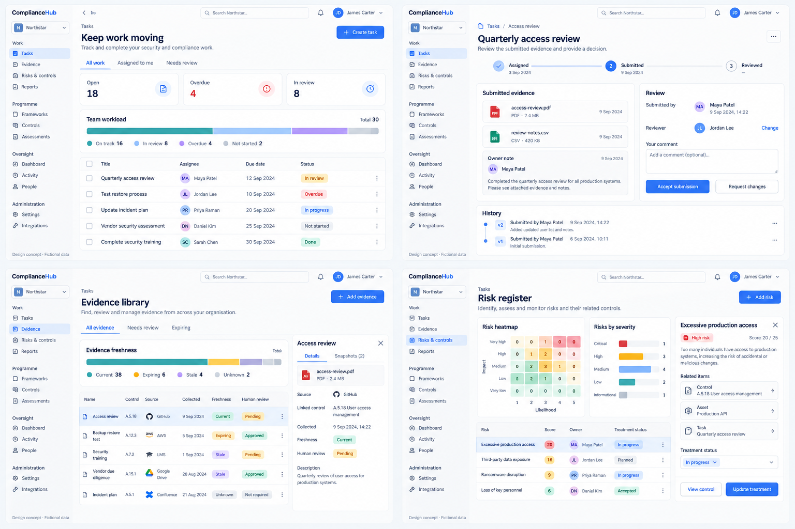
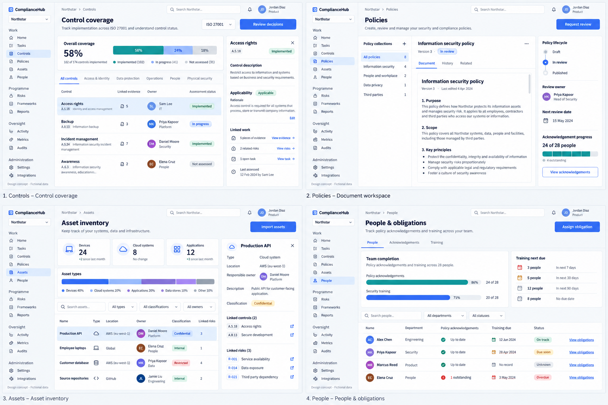
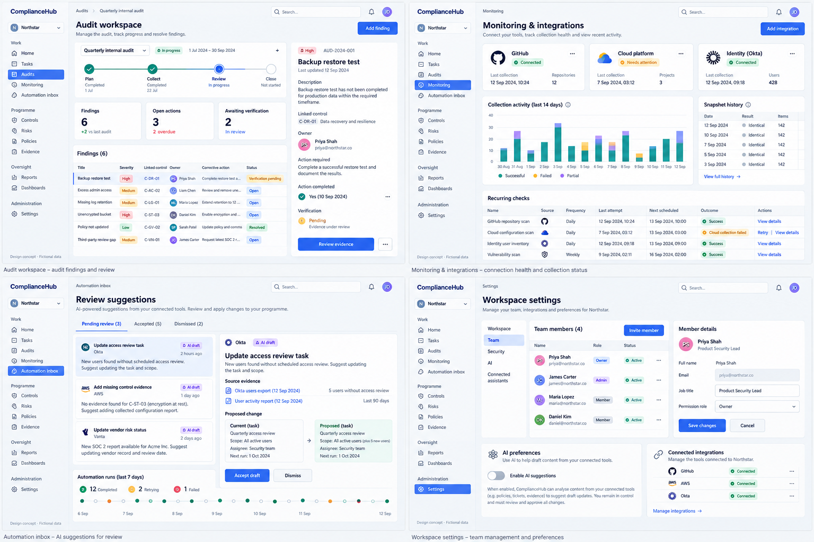
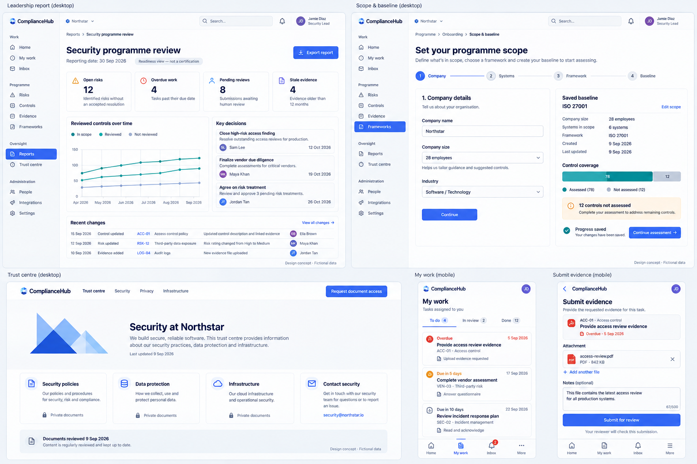

# ComplianceHub — product-wide visual proposal

9 September 2026. **Proposed design, fictional data, not the running application.**

Five generated images cover 18 desktop and mobile views. The proposal connects ComplianceHub's ongoing programme: scope and baseline, accountable work, controls, risks, evidence, policies, people, assets, audits, recurring checks, leadership decisions and administration.

## Recommended direction

Use a quiet light workspace with white surfaces, strong navy text, blue primary actions and teal charts. Keep generous spacing around important information, while making tables efficient to scan. Colour should communicate a labelled status. The product should feel like one application even when a page needs a different layout.

- **Overview and reporting:** visual summaries with source-linked trends and decisions requiring attention.
- **Registers:** a compact graphical summary, a useful filter bar, readable rows and one clear primary action.
- **Details and reviews:** a focused content area with ownership, evidence, history and the decision alongside it.
- **Documents:** readable document typography and a separate lifecycle panel.
- **Administration:** clear sections with focused forms.
- **Mobile:** assigned work and review actions presented as touch-friendly cards.

These are proposed layouts for existing product areas. New graphs, report blocks, global search, navigation arrangements and any unfamiliar actions shown need to be checked against actual capabilities before implementation. They do not establish new permissions or a commitment to new integrations.

## 1. Programme dashboard

The overview gives equal prominence to what changed and what needs a decision. It separates risks, overdue tasks, pending reviews and expiring evidence. Chart panels cover reviewed controls, risk distribution, evidence freshness and team work.

## 2. Work, evidence and review

Four views: task register, submission review, evidence library and risk register with linked context. Review decisions sit beside submitted evidence. Freshness and human approval are separate fields. A selected risk keeps its linked control, asset and task visible.

## 3. Programme records

Four views: control coverage, policy document, asset inventory and people with obligations. The policy view combines readable content with lifecycle and acknowledgements. Asset responsibility remains separate from location. Missing assessment and training information stays visible.

## 4. Oversight and administration

Four views: audit workspace, monitoring and integrations, automation suggestions, and workspace settings. Corrective action completion is distinct from successful verification. Failed collection has a visible recovery action. AI suggestions retain their sources and require a human decision.

## 5. Leadership, entry and mobile

Five views: leadership report, saved scope/baseline, trust centre, mobile assigned work and mobile evidence submission. Leadership sees decisions and source-linked changes. The baseline is resumable. Contributors get a focused submission flow.

## Reference material

Original layouts were generated from these design principles, without copying reference artwork into the repository:

- [Copilot Money dashboard on Mobbin](https://mobbin.com/screens/0abca29e-c16e-45bb-9134-21dbc0c20c37): inspected chart cards, restrained navigation and visual summaries.
- [Linear work list on Mobbin](https://mobbin.com/screens/94bb4d3b-a8e3-41e8-b8f1-b82d1f904b03): inspected practical lists and view controls.
- [Linear preferences on Mobbin](https://mobbin.com/screens/826b126d-ef34-4f69-85b0-54ecc26df03c): inspected focused settings rows.
- [Linear dashboard guidance](https://linear.app/now/dashboards-best-practices): dashboard structure and purpose.
- [SaaSFrame analytics gallery](https://www.saasframe.io/categories/analytics): additional analytics patterns, including charts, tables and side panels; public gallery reviewed, not its paid files.
- [Drata dashboard overview](https://help.drata.com/en/articles/13259515-dashboard-overview): compliance-specific dashboard content; textual reference, not a copied visual.

## Visual review and implementation limits

All five generated outputs were inspected for page composition, readable hierarchy, major content coverage and separation of workflow states. The images are useful for choosing visual direction; they are not pixel-exact specifications or tested interfaces.

Image generation introduced details that must **not** be carried into implementation as requirements:

- Sidebar groupings, names and active states vary between boards. Use one route-backed navigation model in the real app, filtered by actual permissions.
- Fictional counts, chart proportions, dates and control identifiers are not consistently reconciled across boards. Real charts must derive from consistent records and label their population, units and reporting period. Missing historical records must display unavailable history.
- The generated leadership card describes stale evidence as older than 12 months. This is **not an agreed rule**: use the application's actual freshness and review rules.
- Generated provider names and connection states are illustrative, not proof of an implemented or verified connector.
- The settings board puts an AI preview beside Team. Keep actual settings changes within their proper section and existing permission boundaries.
- Any risk acceptance or review controls must follow established authority checks. An action shown in a picture does not grant a role permission.
- Dashboard overdue counts may overlap work states; implementation must not use a mutually exclusive stacked bar unless its categories are defined that way.
- Control progress is not certification. A saved task, accepted submission, current evidence item and provider-verified resolution remain different facts.

No app source, database, permissions or running build changed in this mockup batch. There are no new automated, live-provider, hosted or human acceptance claims. These are static images; keyboard interaction, contrast compliance, responsive behaviour and persistence must be tested when implemented.

## Next implementation increment

Apply the selected visual language to the shared shell and programme dashboard, using existing data and truthful empty states. Demonstrate desktop and mobile behaviour before extending the same patterns to the registers and detail views.

The [release checklist](../../release-checklist.md) remains the project status source. [Generation prompts](prompts.md) record the complete prompt set and built-in generation mode.

