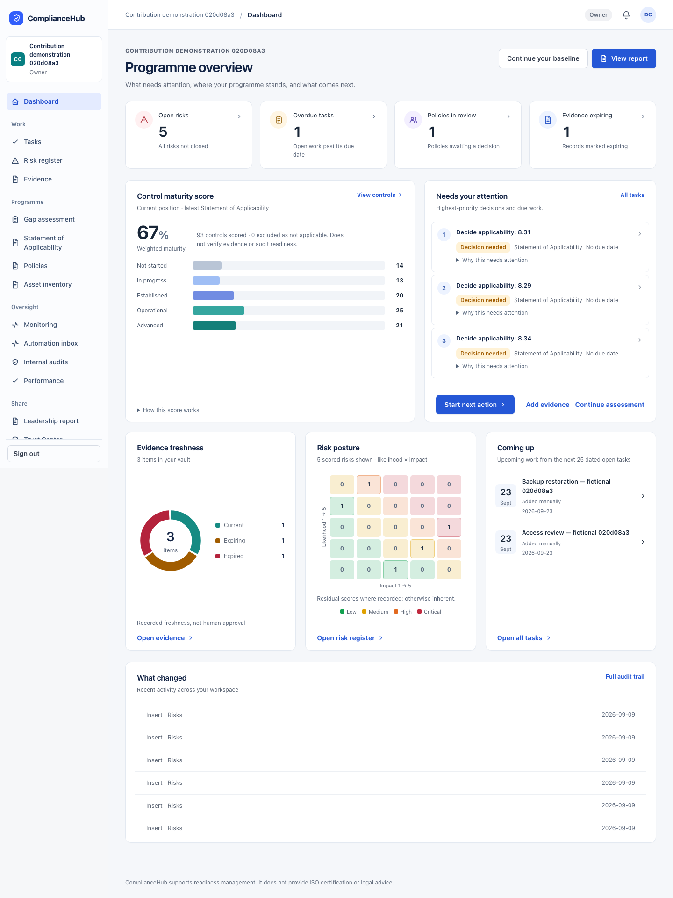

# Programme dashboard — implementation and local evidence

9 September 2026. Starting source: `f6ac518`. [Specification](../superpowers/specs/2026-09-09-programme-dashboard-design.md). [Independent reviews](2026-09-09-programme-dashboard-review.md).

## What changed

Previously, the dashboard led with a separate baseline button and a circular weighted score. Control distribution lived in another card; the action queue displayed long explanations immediately. It had no cross-programme attention-count strip.

Now the page is Programme overview. Four clickable cards show full-workspace counts for non-closed risks, overdue open work, policies awaiting review and evidence recorded as expiring. These are exact count reads, independent of capped lists. Unavailable counts stay unknown and query failures preserve the existing error recovery.

The broad control card retains the existing maturity calculation, with horizontal status bars and its denominator explanation. The top-three action queue keeps its priority order; each reason remains available in a native disclosure. Applicability decisions use an amber Decision needed label. Risk and evidence graphics have source links; unscored risks and capped populations are explicit. Upcoming tasks have dates and a full-register route.

The shared shell uses the approved light canvas, navy text and clearer blue navigation state. Breadcrumbs identify the actual workspace and route. Existing routes, roles, notifications, drawer behaviour and the member overview remain intact.

No synthetic mockup numbers, historical trend, global search, permission expansion, schema change or provider operation was introduced.

## Fresh verification

- Full unit suite: 308 files, 2,663 passed and three existing skips before the final presentation refinement.
- Final affected rendering/role checks: four files, 45 passed after the refinement.
- Type checking and full lint passed; the final production build includes a fresh type check. Affected lint was rerun after the final edits.
- Final candidate production browser run: four journeys passed in 21.1 seconds. Tested real persisted fictional records through local Supabase API 55321, against the candidate app at 3302.
- Populated dashboard at 1440, 883 and 393px: exact counts, closed-risk/done-task exclusions, control bars, reason and score disclosures, overdue drill-through, and no document overflow.
- Empty dashboard: measured zeros, absent controls, scoped empty upcoming work. Member sign-in retains its existing overview without operator summary cards.
- Existing shell/settings regression journey: keyboard drawer, focus isolation, role navigation, saved job title and hash history; representative tasks, risks, evidence and policy pages at desktop/tablet/mobile widths.
- Automated WCAG 2 A/AA scans found no serious or critical findings in the demonstrated affected views. The existing Settings check also requires zero findings. Visual review supplements these scans.

Initial browser acceptance failed only because the newly written member test expected capitalised Assigned while the existing page says contribute to assigned tasks. The test now checks the actual member overview and capability text. A final type check also caught a redundant applicability comparison after an early return; that unreachable comparison was removed and the build rerun.

## Images

All screenshots contain fictional local records. The populated design demonstration uses a separate newly created workspace; its data must not be compared with the familiar baseline workspace.

[Populated mobile](programme-dashboard-2026-09-09/populated-mobile.png) · [Populated tablet](programme-dashboard-2026-09-09/populated-tablet.png)

The familiar baseline workspace is preserved. Its before/after images show the presentation change using the same saved records; no data was added to it to make the graphs look fuller.

## Limits and next increment

Candidate browser proof is local fictional evidence. Background-preview replacement is recorded separately after source commit and runtime verification. There is no new live-provider verification, hosted release or stakeholder acceptance.

Remaining work includes applying the approved layouts to task/register/detail pages and the other product areas. Historical charts require compatible dated records. Policy-review totals are deliberately not labelled as a combined review queue; contribution-review permissions and assignment revisions remain governed by their existing workflow.
