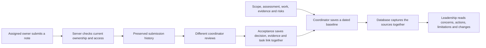
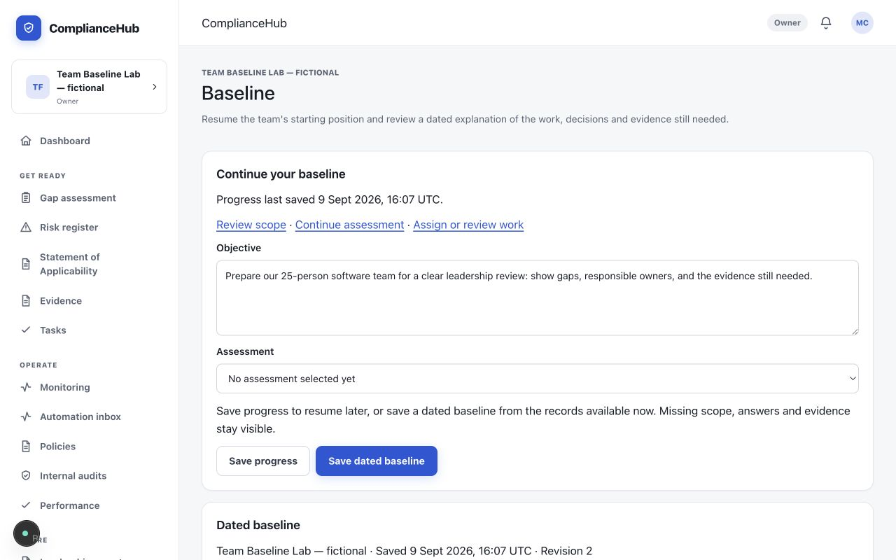
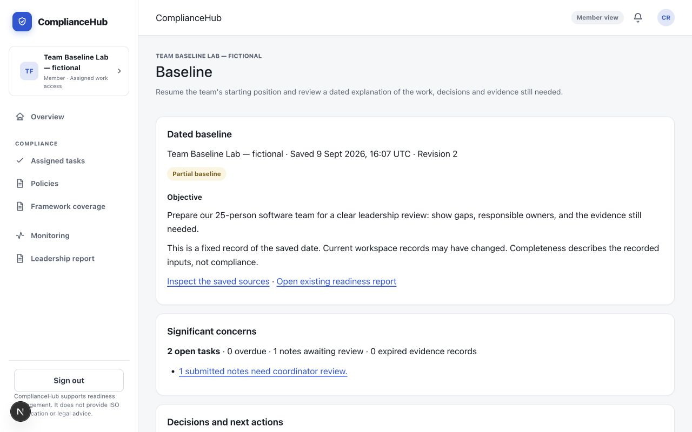

# Connected baseline — change evidence

9 September 2026. This completes the first connected workflow in the [approved product and architecture plan](../superpowers/specs/2026-09-09-compliancehub-focused-architecture-design.md). The [release checklist](../release-checklist.md) remains the project status record.

## What this gives a twenty-person software startup

The coordinator can save the team's starting objective and chosen assessment, leave, and resume later. A dated baseline gathers the recorded scope, unanswered questions, open work, submitted notes, evidence and risks into one preserved explanation. Leadership can see what needs attention, who owns the work, what changed, and where evidence is missing.

Together with [assigned submissions and coordinator review](2026-09-09-team-contributions.md), this removes two repeated copying steps: an accepted owner note becomes linked evidence automatically, and a saved leadership baseline gathers its supporting records automatically. Actual time savings still need to be measured with the intended team.

## How the backend supports the visible workflow

Each write checks the signed-in person's current workspace access in the database. Submission and review writes use narrow operations rather than granting contributors general editing rights. Repeated requests reuse the original result; competing edits return a clear conflict. A saved baseline preserves its source content, so later edits do not rewrite what leadership saw earlier.

This increment uses transactional database operations. Durable background jobs remain a later phase: they are scheduled work recorded persistently so collection or reminders can recover after interruption, retry safely and expose failures. No new recurring provider automation was added here.

## What the leadership view means

| Visible information | Meaning |
|---|---|
| Partial baseline | Required starting inputs or evidence are missing; a saved record is still useful. |
| Significant concerns | Recorded overdue or unassigned work, pending reviews and material risks, with source references. |
| Decisions and next actions | Follow-up work for a coordinator or accountable owner. These suggestions are not recorded approvals. |
| Evidence limitations | Unanswered questions, missing support, expired evidence and the boundaries of this snapshot. |
| Changes since previous baseline | Changes in recorded counts, only when objective, scope, assessment catalogue and calculation basis remain comparable. |
| Saved source details | Preserved copies of the records that supported the explanation, including contribution and review provenance. |

Marking a task Done and accepting its note remain separate actions. Neither demonstrates that a live system was fixed. Opening a baseline does not record Charlie's approval. The product does not label these steps as certification.

## Demonstrated behavior

The browser test uses separate fictional coordinator, assigned-owner and leadership-reader accounts. It saves progress and verifies the same objective and assessment after reload; creates a partial baseline with unanswered questions and expired evidence; accepts a submitted note; separately marks its task Done; and saves a successor showing open work changing from two tasks to one. The original snapshot remains byte-for-byte unchanged.

Changing the recorded scope makes the next comparison explicitly unavailable. The leadership reader still sees the original scope in the old record and cannot edit the baseline. Actual concurrent requests demonstrate that identical retries return one result and conflicting edits cannot silently overwrite each other.

## Visible result

These screenshots come from the hands-on development preview with fictional Team Baseline Lab accounts. Form widths, section headings and mobile table scrolling were improved after this review; the images below show those corrections. Production-browser proof is recorded separately.

[Mobile coordinator form](team-baseline-2026-09-09/baseline-progress-mobile.png) · [Mobile leadership view](team-baseline-2026-09-09/baseline-reader-mobile.png) · [Mobile work table](team-baseline-2026-09-09/baseline-mobile-table-final.png)

The final review also corrected a closed-task message: a pending note now clearly says it cannot be reviewed until a coordinator reopens the task. The saved note remains unchanged. The final production browser check demonstrates both closure and reopening. [Closed-task history on mobile](team-baseline-2026-09-09/closed-task-pending-history-mobile.png).

## Operational choices

- Reassignment preserves the previous owner's note in history, but it cannot be approved as the new owner's work.
- Dated baseline retries can recover the original saved result. An old draft-save retry after a newer edit requires a reload, preventing stale content from replacing newer work.
- Evidence freshness is evaluated at the saved date. Explicitly expired, withdrawn or superseded records are not silently upgraded to current evidence.
- The first contribution type is a written note. File submission and live-provider verification are separate work.

## Verification record

- Application source: reviewed baseline commit `4f1e3f9`, final closed-task wording correction `f280e76`, and final production build `9792b20`. Test diagnostics were tightened in `55acaea` without changing application behavior. Source is pushed to the existing GitHub feature branch.
- Fresh focused baseline checks: 53 unit tests and 128 database assertions passed; the later closed-task correction passed 27 focused component/domain tests, with its four expected pre-fix failures retained; typecheck, lint and Supabase security advisors passed. Assigned-contribution checks are recorded in the linked earlier report.
- Fresh full local database suite: **99 files / 2,154 checks passed** against the isolated database with both new migrations applied. This verifies the resulting schema and behavior; it does not establish a fresh hosted migration or full-chain upgrade rehearsal.
- Full unit suite before the final wording correction: **2,544 passed, three skipped, one failed**. The remaining SoA colour-token assertion was also reproduced on untouched original source `27ba366`; it was not removed or weakened. Standard tooling notices remain in raw logs.
- Fresh production build succeeded. After the local memory recovery below, **all eight desktop/mobile browser and real API scenarios passed in 42.9 seconds, zero retries**, on final production build `9792b20`, including closing and reopening a task with a pending note. The interrupted runs remain in local evidence and are not counted as passes.
- Hands-on desktop/mobile visual review confirmed save/resume/history and the Member reader. Root also opened the production coordinator dashboard, followed its baseline entry and inspected the saved screen. A separate hands-on production check verified the fictional leadership reader’s overview → saved-baseline entry → read-only report → successful sign-out. [Member overview](team-baseline-2026-09-09/production-member-overview.png) · [Member baseline](team-baseline-2026-09-09/production-member-baseline.png). [Production preview screenshot](team-baseline-2026-09-09/baseline-production-preview.png).
- Fresh health checks after acceptance: both the familiar demo and new preview report application and database OK. The preview is running at `http://127.0.0.1:3200/app/baseline` with a separate fictional database.

### Local reliability correction

The combined run exposed memory pressure in the local container virtual machine: its 2 GB allowance had only 47 MB available, and database reads, sign-ins and saves began timing out. The allowance was increased to 4 GB and the previously running services were restarted with their saved databases retained. Available guest memory recovered to over 2 GB; database health returned in 4–5 milliseconds, and the same application build passed the full eight-case workflow run.

This changed the Mac's local container-memory configuration, not hosted infrastructure. The previous configuration and service inventory are saved in ignored local artifacts for recovery. No database reset was performed. The familiar demo had a brief database interruption during this restart. This resolves the resource shortage observed in this test; it does not establish the cause of an older, separately recorded app stall.

Independent task reviews, a combined-branch review and a scoped correction review found no remaining actionable defects in this feature. This is a code-review result, separate from stakeholder acceptance.

Exact test logs, runtime identity, memory observations and private fictional sign-ins remain in ignored `artifacts/team-baseline`. Only sanitized screenshots, this report and repeatable tests are published.

No hosted deployment, external message, live-provider write or real stakeholder acceptance is claimed. The familiar local demo and its database remain separate from this preview.
