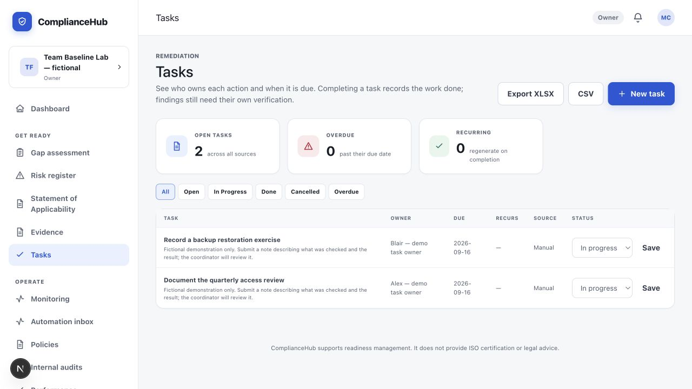
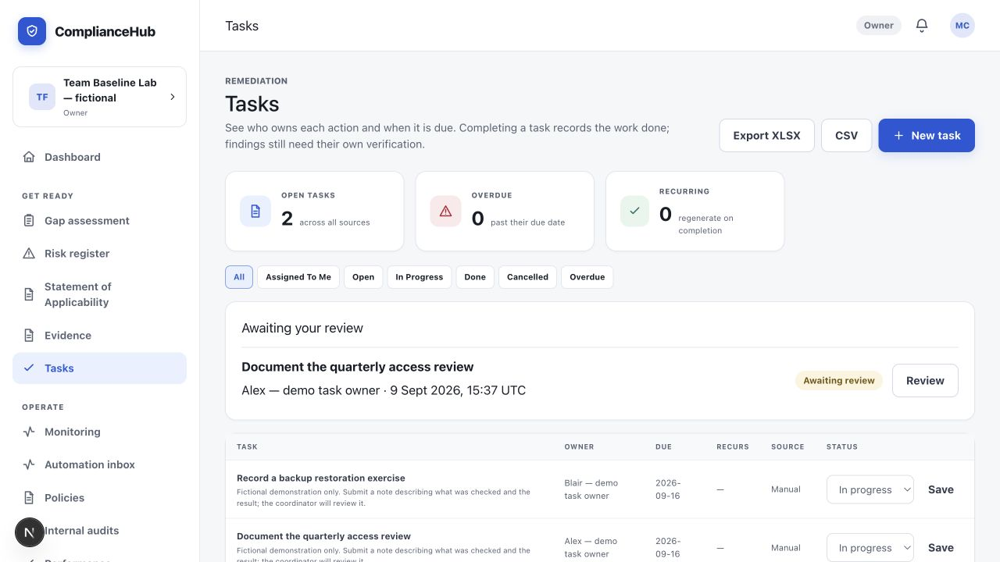
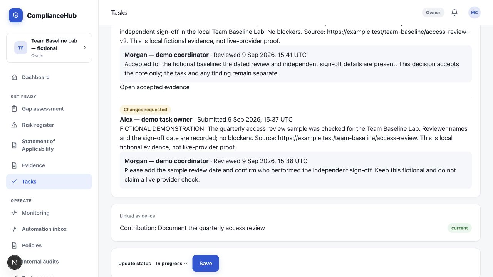

# Assigned work and review — change evidence

9 September 2026. This report covers the first delivered feature in the connected-baseline plan. The main project status remains [the release checklist](../release-checklist.md).

**What changed:** An assigned team member can submit a written work note. A different coordinator can request changes or accept that exact note. Acceptance creates the evidence record and its task link together, so the coordinator does not have to copy the owner's update into the evidence vault. Earlier submissions and decisions stay visible.

**What you see:** “Assigned tasks” in the Member navigation, “Assigned to me” in Tasks, an “Awaiting your review” queue for eligible coordinators, a submission form, review controls and dated history. Typed notes survive rejected saves. Members see the accepted note and decision in history; evidence-vault access retains its existing restrictions.

**What it does not establish:** Accepting a note does not complete the task, resolve a finding, verify a provider change, measure time saved, or establish Charlie's acceptance. This first contribution type is a written note. Source URLs inside notes are plain text and must be copied to open; contributor file uploads are outside this increment.

## Visible before and after

The screenshots below were personally inspected using the running development preview, with fictional Team Baseline Lab data. They contain no passwords or connection credentials. Production-browser verification is recorded separately below.

Before: the Tasks list had no contribution review queue.

After: a coordinator can find an owner's pending submission directly.

The old change request, revised note and acceptance remain visible. Linked evidence and task status are separate.

[Open the mobile history screenshot](team-contributions-2026-09-09/review-history-mobile.jpg).

## Demonstrated journey

Separate fictional accounts represented a coordinator, two assigned owners and a leadership reader. The demonstration covered owner submission → coordinator change request → revised submission → coordinator acceptance → linked evidence. The other owner's submission remained waiting, giving the queue a real pending item. The task remained In Progress. The leadership reader could inspect the two review decisions but could not submit unrelated work or approve it.

The hands-on visual review covered desktop at 1280 × 720 and mobile at 390 × 844. The mobile document, body and main content all measured 390 pixels wide, with no page-level horizontal overflow. These were separate sign-ins operated for a fictional demonstration, not acceptance by separate real employees.

## Backend evidence and why it matters

| Check | Result and practical meaning |
|---|---|
| Assigned ownership and workspace boundaries | Unrelated people, another workspace and removed/reassigned owners cannot submit under the old assignment. |
| Retry and simultaneous requests | Identical requests return one saved submission. Different simultaneous requests cannot create two active pending submissions for one assignment. Reusing a request key with different content is rejected. |
| Independent review | The submitter cannot approve their own note, including when that submitter also has an operator role. |
| Acceptance transaction | The decision, note evidence and task link are saved together. A forced link failure leaves no partial acceptance or orphan evidence. |
| History protection | Completed decisions and note payloads cannot be edited. A reassigned owner's old pending note is retained as no longer reviewable. Background service roles have no direct privileges on this history table. |
| Separate outcomes | Acceptance leaves the complete task and finding rows unchanged. The app continues to show their own statuses. |
| Error recovery | A stale or rejected save preserves the typed work/review note so it can be corrected. |

The real API test uncovered a retry loop that the direct database tests did not expose. Business conflicts now return a normal conflict response. This matches [Supabase's guidance on custom serialization errors](https://supabase.com/docs/guides/troubleshooting/high-cpu-and-infinite-transaction-retries-when-using-custom-error-codes-in-rpc-functions-77326b). This correction is limited to the new contribution operations; no claim is made about the cause of an older app stall.

## Verification record

- Feature source: `4bef959`; reviewed permission correction: `69ce9fc`, pushed to `codex/team-baseline` on the owner's existing GitHub repository.
- Fresh focused application checks: 119 passed; typecheck and lint passed.
- Fresh full unit run: 2,519 passed, three skipped, one failed. The remaining SoA colour-token assertion also fails on the untouched original application source `27ba366`; this feature does not change or weaken that test.
- Fresh full local database run: 98 files / 2,071 checks passed before the final inherited-privilege correction. The correction then passed all 155 relevant permission/behavior checks, including seven explicit denied background-service privileges.
- Fresh development browser checks passed on desktop and mobile, including the actual concurrent API scenario.
- Production runtime: the reviewed source is served locally at port 3200 against the separate local database at port 55321. Fresh health reports app and database OK with the reviewed source identity. Production-browser acceptance passed all four desktop/mobile UI and concurrent-API scenarios in 37.3 seconds, with zero retries.
- The familiar demo at port 3100 and its database at port 54321 remain separate. No hosted deployment, live-provider mutation or external message was made.

Exact raw test output, private synthetic fixture sign-ins and the production runtime manifest remain in ignored local artifacts. They are not published as application source. The tests themselves are committed in the feature branch for repeatable verification.
