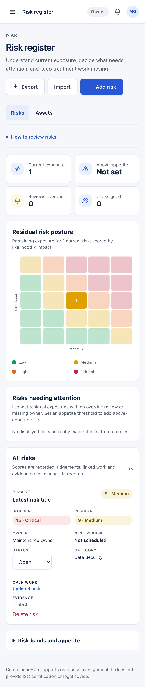
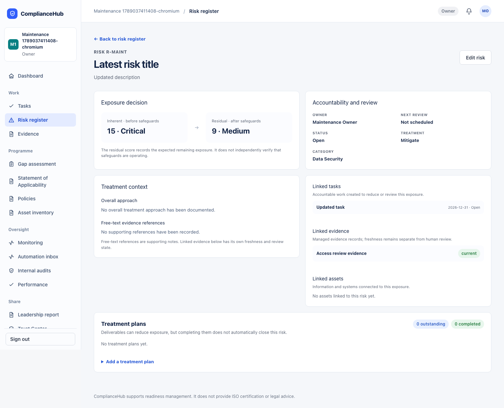

# Risk workspace refinement — implementation and local evidence

10 September 2026. Starting source: `75b6d3964b23aab077bef30823f13f1ce7fd82e9`. Implemented application source: `cabc4ff56ff519e99f198458147e8e1dc4dfc3a7`.

## Before and now

Previously, the risk register mixed an oversized matrix, editable configuration and a wide table. Phone users had to scroll sideways to find scores, status and review dates. An unset appetite looked like zero risks above appetite, which could give false reassurance. Risk detail presented flat metadata, assets and treatment plans without connected tasks or managed evidence. Cancelled treatment work could look complete. Create and Edit were long generic forms; a failed or stale save could lose working context or overwrite a newer decision.

Now the register starts with current exposure, whether appetite is configured, overdue reviews and missing owners. The same saved scores and thresholds drive a compact heatmap, attention list and records. Desktop uses a fitted table; narrower desktop, tablet and phone layouts use cards with the same ownership, scoring, status, review, linked-work, evidence-freshness and authorised controls. Configuration remains available below the operational view.

Risk detail now puts inherent and residual exposure beside accountability and review, then connects treatment context, tasks, managed evidence and assets to their source records. Managed evidence keeps its own freshness state and link; free-text references remain supporting notes. Treatment progress reports completed, cancelled and outstanding work separately. Reference suggestions read the complete workspace in pages, while database uniqueness remains the final guard.

Create and Edit now share one grouped, responsive form for context, scoring, treatment and review. Required and optional fields are visible, pending saves disable duplicate clicks, validation and save failures retain the draft, and a stale tab cannot overwrite a newer risk change. Members retain read access without management controls. Assessment-gap acceptance now requires a current `no` or `partially` response from the active workspace and records the accepted question, answer and observation time for review.

## Fresh verification

- Full unit suite: 315 files passed; 2,710 tests passed and three intentional skips. The first full run found one repository contract that described the replaced reference query; the updated contract and final full run pass.
- TypeScript and ESLint pass. The exact production build for `cabc4ff56ff519e99f198458147e8e1dc4dfc3a7` passes.
- Correctly configured localhost integration suite: five files and eight tests pass. The first invocation omitted `.env.local` and stopped three suites before collecting tests; the rerun used Node's environment-file loader.
- Database suite: 100 files and 2,218 checks pass against the preserved local Supabase stack. No migration, reset or record deletion was used.
- Focused risk tests cover recoverable drafts, stale edits, Member restrictions, workspace-scoped gap acceptance, unavailable reads, selected owners/categories, cancelled treatment progress, complete paginated reference selection, and responsive linked context.
- The production browser journey passes on desktop Chromium at 1,440 px and phone Chromium at 393 px. It creates and edits a fictional risk, rejects a stale second-tab save while retaining the draft, creates linked work and managed evidence, opens those source records, checks tablet layout at 883 px, verifies no document overflow and runs automated accessibility checks.
- The journey passed against the packaged candidate and again against the final independent background process at `http://127.0.0.1:3300`. Fresh health reports `status: ok`, `db: ok` and the exact application source SHA.
- Independent standards and specification reviews were run against the recorded starting commit. The initial review found an invalid evidence link, missing mobile linked context, a 1,000-row reference limit and duplicated status terminology. The fixes were re-reviewed; neither reviewer reports a material remaining finding. Separate visual inspection found no remaining material hierarchy, clipping, overflow, typography, focus or mobile-layout issue.

## Images

These are captures from the exact packaged application using newly created fictional browser-test workspaces.

[Register — desktop](risk-workspace-2026-09-10/register-desktop.png) · [Register — tablet](risk-workspace-2026-09-10/register-tablet.png) · [New risk — desktop](risk-workspace-2026-09-10/new-desktop.png) · [New risk — mobile](risk-workspace-2026-09-10/new-mobile.png) · [Stale edit recovery](risk-workspace-2026-09-10/stale-edit-desktop.png)

[Risk detail — mobile](risk-workspace-2026-09-10/detail-mobile-linked.png)

## Running preview and limits

Application source `cabc4ff56ff519e99f198458147e8e1dc4dfc3a7` is committed and pushed to `origin/codex/team-baseline`. Its immutable 71 MiB production package is running independently at http://127.0.0.1:3300/app/risks with a 1.5 GiB Node heap limit and the preserved fictional local database. About 8.4 GiB remains free on the Mac after packaging; only the final app process is retained for this batch.

This establishes implemented code, passing automated checks and fictional local behavior. It does not establish a hosted release, live-provider verification, a formal audit conclusion or human acceptance by Mukta, Charlie or another intended user. A separate risk-acceptance decision-history model and historical exposure trends remain outside this increment.
