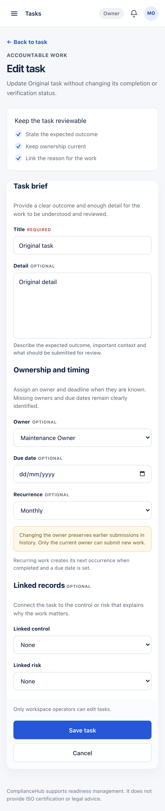

# Task creation and editing — implementation and local evidence

10 September 2026. Starting source: `3f61f16`. Implemented application source: `8c5b729d7db33e0af0e8a6601816522e6f6117e6`.

## Before and now

Previously, New Task and Edit Task used one dense generic form headed “Remediation”. All fields had the same visual weight, there was no clear Back or Cancel action, and recurrence wording implied that every recurring task would regenerate even when it had no starting due date. A normal validation or database error replaced the form, losing the operator's working context. Two coordinators editing the same task could also overwrite one another. Very large choice lists could omit the saved owner, control or risk and silently clear that relationship on the next save.

Now both routes share one deliberate task form. Task brief, ownership and timing, and linked records have separate sections; required and optional fields are visible; inputs have clear hover, error and keyboard-focus states; and actions stack into comfortable full-width controls on mobile. The helper text states the real rule: a recurring task creates its next occurrence only when completed and when a due date exists. Reassigning a task explains that earlier submissions remain in history while only the current owner may submit new work.

The backend behavior now matches the safer interface. Members are rejected before task creation writes. Expected validation and save failures appear inside the form while its values remain. Each edit carries the task version it began with, so a stale tab receives a reload message and cannot overwrite a newer save—even if a server refresh occurs while the local draft is open. The current owner, control and risk are fetched independently and retained when the main option list does not contain them.

Task completion, evidence acceptance, finding verification and evidence freshness remain separate. This increment does not change task status, task source, contribution history, review history or finding decisions.

## Fresh verification

- `npm run verify` passed: full lint, TypeScript, 313 unit-test files with 2,688 passing tests and three intentional skips, and the Next.js production build.
- Correctly configured localhost integration run passed five files and eight tests. The first invocation omitted `.env.local`, so three suites stopped before collecting tests; rerunning with Node's environment-file loader resolved that command setup error.
- `npm run test:db` passed all 100 database files and 2,218 checks. No migration, reset or record deletion was used for this batch.
- The focused create/edit browser journey passed twice on desktop Chromium and 393px mobile against the candidate, then passed twice again against the packaged candidate, and twice against the final background process on port 3300. It creates and edits a fictional task, confirms status/source remain unchanged, runs an automated accessibility scan, and proves a stale second tab cannot overwrite the first tab while retaining its unsaved detail.
- Independent specification and standards reviewers found no material issue after selected-owner preservation, draft/version pinning, complete field-error associations and neutral missing-metadata wording were added.
- Independent visual review inspected New and populated Edit views at desktop and 393px. It found no material clipping, overflow, spacing, hierarchy, label, focus or touch-layout issue after the form-control styling was refined.

## Images

The approved mockup is a design proposal; the other images are captures from the exact packaged application using newly created fictional browser-test workspaces.

[Approved mockup](task-form-2026-09-10/approved-mockup.png) · [New task — desktop](task-form-2026-09-10/after-new-desktop.png) · [New task — mobile](task-form-2026-09-10/after-new-mobile.png) · [Edit task — desktop](task-form-2026-09-10/after-edit-desktop.png)

## Running preview and limits

Application source `8c5b729d7db33e0af0e8a6601816522e6f6117e6` is committed and pushed to `origin/codex/team-baseline`. An immutable production package built from that commit is running independently at http://127.0.0.1:3300/app/tasks/new with a 1.5 GiB Node heap limit. Fresh health reports `status: ok`, `db: ok` and the exact source SHA. The desktop/mobile browser journey was repeated against this process after the swap.

The demonstration uses the isolated local Supabase database and fictional accounts. It does not prove a hosted release, live-provider behavior, formal audit acceptance or Mukta/Charlie acceptance. The wider product redesign remains an incremental programme; the next page-specific improvement can build on this shared task language without changing the broader compliance lifecycle.
