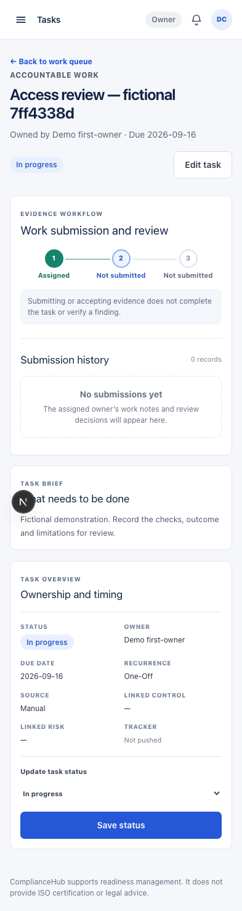

# Accountable work and evidence review — implementation and local evidence

10 September 2026. Starting source: `eab46db`. Design reference: [approved product mockups](../design/2026-09-09-product-mockups/README.md).

## Before and after

Previously, the Tasks page presented counts, filters and rows as separate blocks, with little explanation of deadline health or where human review belonged. On a task detail page, ownership metadata came before the contributor's work and reviewer decision, especially on mobile. A task connected to more than one external tracker could also fail to load because the page expected one tracker row.

Now the Tasks page is a single work queue. Exact cards show open work, overdue work and submissions the current operator may review. Deadline health keeps dated on-track, overdue and undated work distinct. The review queue appears before the task register, and task rows become readable cards on small screens while retaining owner, due date and status.

Task detail now leads with the evidence workflow: assignment, submission and independent human decision. It explains that accepted evidence does not complete the task or verify a finding. The full submission history remains visible, and ownership, timing, status and all connected trackers sit in a compact overview. Unassigned and closed states use truthful labels and do not imply that blocked work is progressing.

The same permissions and data meaning remain in force. Only the current assignee can submit on active work; an independent authorised operator can review; reassignment preserves history while revoking the former owner's authority. Accepted notes create linked evidence, while task completion, finding resolution, evidence freshness and provider verification remain separate.

## Fresh verification

- Focused task rendering and behavior: 14 files, 113 tests passed. The final reviewer-wording regression scope passed four files and 29 tests.
- Full unit suite: 310 files, 2,674 tests passed and three intentional skips.
- Local database suite: 100 files and 2,218 tests passed after applying four already-reviewed repository migrations to the preserved local database. No database reset or record deletion was used.
- Type checking, full lint and the Next.js production build passed.
- Fictional browser workflow: four tests passed on desktop and 393px mobile. This covers owner submission, change request, resubmission, independent acceptance, leadership read access, duplicate-click protection and reassignment revoking old authority.
- Independent specification and standards reviews found no material remaining issue after four correctness findings and one permission-scoped wording issue were resolved.
- Independent visual review found no material issue in the populated desktop and mobile work queue, task detail, review form, empty filter state or keyboard focus. The local fixture had no unassigned or closed detail for final visual inspection; those states are covered by automated behavior tests.

The first database run exposed that the retained local database was four migrations behind the repository. The schema was advanced in place, and the complete database suite then passed. This repaired the local verification environment; it is not evidence that a hosted database was migrated.

## Images

All images use fictional local workspaces and records.

[Before — Tasks desktop](task-work-review-2026-09-10/before-tasks-desktop.jpg) · [After — Work queue desktop](task-work-review-2026-09-10/after-tasks-desktop.png) · [After — Work queue mobile](task-work-review-2026-09-10/after-tasks-mobile.png)

[Before — task detail mobile](task-work-review-2026-09-10/before-task-mobile.jpg) · [After — evidence workflow desktop](task-work-review-2026-09-10/after-review-desktop.png)

## Running preview and limits

Verified source `a9dbe88baf3b4b946ee466661ef4281f3e138110` is committed and pushed to the existing feature branch. Its production package runs independently at http://127.0.0.1:3300/app/tasks. Fresh health reports both app and database OK with that exact release identity, and the launcher has operating-system parent process 1 rather than depending on a temporary terminal.

All four desktop/mobile contribution and concurrency journeys were repeated against the actual port 3300 background process and passed in 24.6 seconds. The in-app browser was then refreshed with the new release and inspected: Work queue, exact summary cards, deadline health, review queue and task rows all came from the new build. The images above were captured from the identical source in the temporary candidate before packaging.

This is local fictional proof. It does not establish live-provider behavior, a hosted release, formal audit acceptance or Mukta/Charlie acceptance. Other product areas still need the approved page-specific visual treatment; the next increment should apply the same hierarchy and truthful state treatment to the Risk register and risk detail journey.
