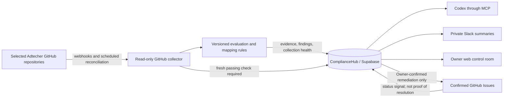

# GitHub-First Compliance Automation Design

**Date:** 2026-08-17

**Status:** Approved in conversation; awaiting written-spec review

**Product:** ComplianceHub internal tool for Adtecher

**Primary framework:** ISO/IEC 27001:2022

## Executive summary

ComplianceHub will evolve from a web application that people manually maintain
into an internal compliance engine. The first automation phase will connect to
selected Adtecher GitHub repositories, collect repository-security facts,
evaluate those facts with deterministic rules, and store traceable evidence or
findings. Codex will explain the verified state through the existing MCP
interface, Slack will provide a short daily awareness summary, and the existing
web interface will remain the owner control room for configuration, review,
exceptions, policies, risks, and audits.

The implementation is deliberately GitHub-first. It will prove trustworthy
engineering evidence before adding Azure, Microsoft 365, HR, or other company
systems. It will not claim that GitHub alone establishes complete ISO 27001
compliance.

## Product positioning

“Internal tool” describes the audience, not the absence of an interface.
ComplianceHub is available only to authorised Adtecher users and has four
working surfaces:

1. **GitHub** remains the engineering work surface.
2. **ComplianceHub web** is the owner administration and review surface.
3. **Codex through MCP** is the primary question-and-analysis surface.
4. **Slack** is the awareness and notification surface.

The operating principle is:

> GitHub supplies facts, ComplianceHub organises and verifies them, Codex
> explains them, and people make accountable decisions.

## Current state and gap

ComplianceHub already has:

- a modular Next.js application backed by Supabase Auth and PostgreSQL;
- tenant-scoped evidence, monitoring findings, tasks, risks, policies, audits,
  leadership reports, and immutable audit events;
- GitHub ticket creation and status synchronisation abstractions;
- evidence and monitoring provider abstractions;
- a private OAuth-protected MCP endpoint;
- an Owner-only, duplicate-safe Slack daily digest;
- a live Azure staging deployment and private Slack test channel.

The current GitHub evidence and monitoring providers return deterministic
sample data. They do not yet inspect live Adtecher repositories. Consequently,
the preview workspace can demonstrate the workflow but cannot report real
GitHub compliance posture. This design replaces the GitHub sample providers
with a live, read-only collector while retaining the existing domain boundaries,
RLS protections, Slack delivery safety, and MCP contracts.

## Goals

- Automatically collect trustworthy security and change-control facts from
  explicitly selected Adtecher repositories.
- Convert each collected fact into a stable `pass`, `fail`, `unknown`, or
  `not_applicable` result using deterministic, versioned rules.
- Create traceable compliance evidence for passing checks and actionable,
  deduplicated findings for failed checks.
- Preserve historical results and make evidence freshness visible.
- Recheck GitHub before resolving a finding.
- Make the verified state available to Codex, Slack, leadership reports, and the
  existing web control room.
- Keep human approval for scope, mappings, issue creation, exceptions, and risk
  acceptance.

## Non-goals

- Claiming complete ISO 27001 compliance from GitHub data alone.
- Automatic changes to repositories, branch rules, source code, or workflows.
- Automatic PR design-guideline reviews or code fixes.
- Automatic risk acceptance, exception approval, policy approval, or audit
  conclusions.
- Azure, Microsoft 365, HR, Google Workspace, AWS, or device-management
  collection in this phase.
- Copying repository source code or unnecessary member information into
  ComplianceHub.
- Creating a new dashboard or replacing the existing administration interface.

## System architecture

### Component boundaries

1. **Connection and scope:** owns the GitHub App installation, selected
   repositories, credential lifecycle, and connection health.
2. **Collector:** calls GitHub, verifies webhook signatures, performs scheduled
   reconciliation, paginates safely, and returns provider-neutral observations.
3. **Rule evaluator:** turns observations into deterministic results. It does
   not make network calls or perform writes.
4. **Evidence recorder:** stores immutable, deduplicated passing observations
   and freshness information.
5. **Finding manager:** opens, updates, reopens, or resolves findings using
   stable keys and fresh check results.
6. **Delivery surfaces:** existing MCP, Slack, reports, and web pages consume
   stored results rather than calling GitHub directly.

Each component has a narrow interface so collection, evaluation, persistence,
and communication can be tested independently.

## GitHub connection and permissions

Use a GitHub App rather than a personal access token. The App must:

- be installed only on the Adtecher organisation and explicitly selected
  repositories;
- request read-only access for repository metadata, administration/rules,
  Actions status, Dependabot alerts, code-scanning alerts, and secret-scanning
  alerts needed by the approved checks;
- request no source-code write, issue write, workflow write, or administration
  write permission for collection;
- use short-lived installation tokens obtained server-side;
- keep the App private and store its private credential as an Azure secret;
- support immediate revocation and repository-scope changes;
- show missing or denied permissions as connection-health problems.

Issue creation must remain a separate, confirmed action. If GitHub requires an
additional write permission for that action, it must be isolated from the
read-only collection path and clearly disclosed to the Owner.

The existing application currently represents GitHub ticketing, evidence, and
monitoring connections separately. The live design should avoid three copies of
the same credential: one canonical GitHub installation record supplies
references used by evidence sources, monitor sources, and ticketing. Existing
tenant tables and audit triggers remain, but duplicated encrypted tokens are
removed through a migration rather than silently retained.

## Initial repository checks

The first rule pack covers technical facts that GitHub can establish reliably
for a selected repository:

| Category | Checks |
| --- | --- |
| Repository scope | visibility, archived state, default branch |
| Change protection | branch rules or rulesets exist, direct/force pushes restricted, deletion restricted |
| Pull requests | approving reviews required, stale approvals handled, code-owner review where configured |
| Merge gates | required status checks configured and currently obtainable |
| Dependency security | open critical/high Dependabot alerts and alert availability |
| Code security | open critical/high code-scanning alerts and analysis availability |
| Secret security | open secret-scanning alerts, scanning availability, push protection where licensed/configured |
| Security automation | approved security workflows enabled and latest relevant run status |
| Access posture | repository administration exposure expressed without returning unnecessary member details |

Checks that depend on GitHub plan features or organisation permissions must
return `unknown` or `not_applicable` with an explanation. They must never infer
a passing result from an unavailable API.

Organisation-level checks such as company-wide MFA enforcement and owner-access
governance are deferred until the repository collector is reliable and the
additional permission/privacy requirements have been reviewed.

## Collection model

### Triggers

- An initial full collection runs when the Owner connects and selects a
  repository.
- Verified GitHub webhooks request prompt re-evaluation after relevant changes.
- A scheduled reconciliation runs at least daily to recover missed webhooks and
  refresh all in-scope repositories.
- A manual Owner recheck is available for troubleshooting and remediation
  verification.

Webhooks are change notifications, not the sole source of truth. The collector
must query the relevant GitHub API before persisting a compliance result.

### Observation contract

Every observation contains:

- stable check identifier and rule version;
- GitHub organisation, repository, subject type, and subject identifier;
- result: `pass`, `fail`, `unknown`, or `not_applicable`;
- severity when failed;
- concise title and explanation;
- observed time and freshness deadline;
- canonical GitHub source URL when safe and available;
- source response fingerprint for deduplication;
- collection-run identifier and connection identifier;
- a safe diagnostic code for unavailable, denied, partial, or rate-limited
  collection.

Raw access tokens, response headers, private webhook data, source-code bodies,
and unnecessary personal data are never part of this contract.

## Evaluation and control mapping

### Deterministic evaluation

Rules are versioned code or versioned catalogue data, tested independently from
the GitHub API adapter. Each rule has:

- a stable identifier;
- the required observation inputs;
- explicit pass, fail, unknown, and not-applicable conditions;
- default severity for failure;
- a human-readable remediation recommendation;
- proposed ISO control mappings;
- a rule-pack version.

Codex does not decide pass or fail. It summarises stored results and may explain
the deterministic rule.

### Mapping approval

ComplianceHub provides a standard GitHub-to-ISO mapping pack. The Owner reviews
and approves the pack once for the workspace before its evidence affects
readiness. A later mapping-pack version requires a visible review; historical
evidence retains the mapping version used when it was recorded.

Examples:

| GitHub result | Compliance treatment |
| --- | --- |
| Required PR reviews enabled | Change-management evidence |
| Branch protection disabled | Change-management finding |
| Critical Dependabot alert open | Vulnerability-management finding |
| Approved security workflow passed | Secure-development evidence |
| GitHub permission denied | Collection-health warning; never compliant |
| Repository archived | Explainable not-applicable result for runtime checks |

Exact ISO control references are part of the reviewed mapping pack, not
hard-coded into AI prompts.

## Evidence lifecycle

Passing checks create or refresh evidence with a stable identity derived from
the organisation, connection, repository, check identifier, and mapping
version. A repeat collection must not duplicate evidence.

Each evidence record exposes:

- repository and check;
- status and observation time;
- freshness or expiry date;
- source and safe GitHub link;
- mapped controls and mapping version;
- collection-run and rule version;
- immutable creation/audit history.

When a passing check stops being observed, old evidence remains historically
available but becomes stale. A failed or unavailable collection never deletes
old evidence and never silently extends its freshness.

## Finding lifecycle

A failed check creates one finding keyed by organisation, source, check, and
subject. Repeated failures update its most-recent detection time instead of
creating duplicates. A previously resolved finding reopens if the check fails
again.

Supported states are:

1. `open`
2. `acknowledged`
3. `in_progress`
4. `exception_requested`
5. `risk_accepted`
6. `resolved`

The existing monitoring status enum must be extended through a reviewed
migration. Status transitions, actor, reason, and timestamp are audited.

Every finding contains:

- what failed and where;
- compliance impact and mapped controls;
- severity and deterministic reason;
- recommended remediation;
- first and most recent detection;
- responsible owner and target date when assigned;
- linked task, risk, exception, or GitHub Issue;
- fresh verification evidence when resolved.

Closing a GitHub Issue changes remediation workflow status only. ComplianceHub
resolves the finding only after a new GitHub check passes. Risk acceptance does
not change a failed technical result into a passing result; it records an
accountable business decision and keeps the underlying condition visible.

## Human accountability

ComplianceHub automatically:

- collects technical facts;
- evaluates predefined rules;
- creates or refreshes evidence;
- creates, updates, reopens, and verifies findings;
- detects stale evidence and connection failures;
- supplies verified facts to Codex, Slack, reports, and the web interface.

People approve:

- repositories in scope;
- the mapping pack and later mapping changes;
- remediation issue creation and assignment;
- exceptions and risk acceptance;
- policies, audits, and management decisions;
- whether a genuinely unusual condition is not applicable.

## Interaction surfaces

### Codex through MCP

Codex is the primary question-and-analysis interface. Authorised users can ask
what changed, which repositories need attention, why readiness changed, which
evidence supports a control, and what to prioritise.

MCP read tools return stable identifiers, safe summaries, observation times,
and evidence/finding references. Answers must distinguish verified facts,
unknown information, and recommendations. Read-only remains the default.
The existing web control room may perform an Owner-confirmed GitHub Issue
creation during this phase. Exposing Issue creation or another external write
through MCP requires a separately approved, confirmation-gated write phase.

### Slack

Slack provides awareness, not evidence storage:

- one short daily digest at 09:00 Europe/London;
- immediate alerts only for newly detected critical findings;
- optional reminders for overdue remediation after the pilot;
- links to the relevant GitHub or ComplianceHub record.

The digest contains overall readiness, important changes since the prior
digest, highest-priority findings, overdue actions, and recommended next steps.
Every numeric statement comes from a prepared fact bundle. Slack never receives
credentials, policy bodies, private evidence contents, source code, or
unnecessary member data.

The private `#compliancehub-mukta-private` channel remains the only rollout
destination until the approved staging checks and dogfood period pass.

### GitHub

Engineers keep working in GitHub. After Owner confirmation, a remediation Issue
may contain the failed check, repository, compliance reason, recommended fix,
severity, target date, and ComplianceHub link. Issue status synchronises back,
but does not establish compliance.

### Web control room

The existing web interface remains for Owners and administrators to connect the
GitHub organisation, select repositories, approve mapping packs, inspect
evidence and findings, confirm tasks, approve exceptions and risk acceptance,
manage policies and audits, configure Slack, and view the audit history.
Routine repository facts are not manually re-entered.

## Security requirements

- Authenticate every web and MCP caller and retain current organisation RLS.
- Keep GitHub credentials server-side and encrypted or referenced from the
  platform secret store.
- Verify GitHub webhook signatures and reject replayed or excessively old
  deliveries.
- Enforce Owner-only connection, scope, mapping, exception, risk, and external
  write operations.
- Paginate and bound all GitHub reads; respect rate-limit signals.
- Redact credentials, response headers, private repository bodies, and member
  details from logs and errors.
- Keep stable audit records for connection changes, collection runs, mapping
  approval, evidence, finding transitions, and deliveries.
- Preserve cross-tenant denial tests for every new or changed tenant table.
- Treat GitHub and repository text as untrusted data; it must never override
  MCP instructions or become executable prompt instructions.

## Failure handling

| Failure | Required behaviour |
| --- | --- |
| GitHub unavailable | Record collection unavailable; preserve but do not refresh prior evidence |
| Permission removed | Mark connection as needing attention and affected checks unknown |
| Rate limit reached | Stop safely, retain cursor, and retry after the stated reset time |
| Partial repository collection | Commit only complete per-check results and report partial run health |
| Evidence exceeds freshness | Mark stale; never count it as newly verified |
| Duplicate webhook or job | Process idempotently using delivery and observation identifiers |
| Mapping rule changes | Preserve old mapping version and require review for the new pack |
| Slack confirmed rejection | Record failed and allow a safe, deliberate retry |
| Slack ambiguous outcome | Record unknown and never automatically retry |
| Collector defect | Contain the failed source, alert the Owner, and do not improve readiness |

A collection failure must never resolve a finding, remove evidence, or make the
reported compliance position look better.

## Testing strategy

### Unit tests

- Rule outcomes for pass, fail, unknown, and not applicable.
- Severity, remediation text, mapping version, and stable identifiers.
- Evidence and finding deduplication.
- Staleness, reopen, and fresh-verification resolution logic.
- Redaction and safe diagnostic mapping.
- Digest delta and fact-bundle accuracy.

### Integration tests

- GitHub adapter behaviour against sanitised API fixtures for every endpoint,
  including pagination, missing features, permission denial, rate limits, and
  malformed responses.
- Verified webhook signatures, replay rejection, and duplicate delivery.
- Database RLS for Owner, Admin, Member, outsider, and cross-workspace actors.
- Audit history and valid finding-state transitions.
- MCP responses for authorised, unauthorised, unknown, and stale data.

### End-to-end tests

- Connect a dedicated test repository, select scope, collect facts, approve the
  mapping pack, and create evidence/findings.
- Change a repository control, detect and alert once, restore the control, and
  resolve only after a fresh passing check.
- Confirm a GitHub Issue, synchronise its status, and prove that issue closure
  alone does not resolve the finding.
- Prepare a digest, compare every number with the stored fact bundle, post only
  to the private channel, and prove duplicate delivery is blocked.

No CI test calls a live Adtecher repository. The staging proof uses a dedicated
test repository and records only safe identifiers and outcomes.

## Rollout

1. Implement and test the GitHub App connection and live adapter without
   changing readiness.
2. Connect one dedicated test repository and shadow-collect results.
3. Compare every result manually with GitHub and correct the rule pack.
4. Approve the first mapping pack and enable evidence creation.
5. Enable findings while keeping GitHub Issue creation disabled.
6. Test one explicit, confirmed remediation Issue.
7. Run three meaningful private-channel daily digests on separate London dates.
8. Pilot a small set of selected Adtecher repositories.
9. Dogfood for ten business days while monitoring correctness, privacy, and
   collection reliability.
10. Expand repository scope only after the success criteria pass.
11. Design Azure and Microsoft 365 collectors as separate follow-up phases.

## Success criteria

- Every reported repository result is traceable to a GitHub API observation,
  rule version, mapping version, and collection run.
- No unknown or unavailable result is presented as compliant.
- Repeated collection creates no duplicate evidence, finding, alert, Issue, or
  digest.
- A failed check resolves only after fresh passing evidence.
- Removing a protection reopens the relevant finding.
- Permission and tenant boundaries hold under adversarial tests.
- No credentials, source code, private evidence, or unnecessary personal data
  appears in Slack, MCP output, logs, or client bundles.
- Every digest number matches its prepared fact bundle.
- The compliance Owner considers the output dependable after the ten-business-
  day pilot.

## Later phases

After GitHub collection is stable:

1. Azure infrastructure evidence: encryption, public exposure, backups,
   identities, logging, and recovery controls.
2. Microsoft 365 identity evidence: MFA, privileged accounts, inactive users,
   access reviews, and onboarding/offboarding signals.
3. HR, training, supplier, device, and business-continuity integrations where a
   trustworthy source exists.
4. Confirmation-gated task creation through MCP.
5. Separately designed deterministic PR policy checks; automated fixes remain a
   distinct, higher-risk workflow.

Each later integration must reuse the provider-neutral observation, evidence,
finding, audit, MCP, and Slack contracts proven by the GitHub-first phase.
