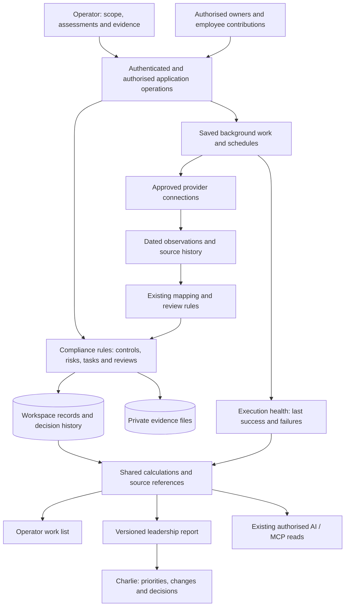
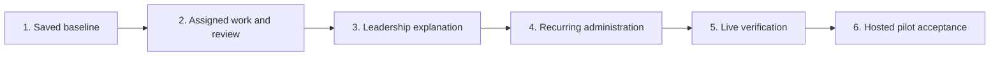

# ComplianceHub: product vision and backend architecture plan

Date: 9 September 2026  
Status: Draft for discussion; not an approved implementation plan. No application changes or fresh runtime tests were performed for this review.

Read sections 1–4 for the product, current position and leadership value. Sections 5–11 explain how the backend supports that value. Section 12 defines small delivery milestones. The current-status section is a dated summary of the existing release checklist, not a separate status tracker.

## 1. The product we are building

ComplianceHub helps a software startup with approximately 20 or more employees coordinate security responsibilities across its workforce, turn gaps into owned work, maintain supporting evidence, and explain its recorded readiness to leadership and auditors.

**Product vision:** give a growing software startup a repeatable way to coordinate security and compliance across its teams, reduce manual chasing and reporting, and give leadership an evidence-backed account of progress, risk and decisions needed.

The owner clarified the intended audience on 9 September 2026: a software startup with at least around 20 employees. One person may lead the company while responsibility for compliance work is distributed among several people. No upper employee limit has been agreed. This is the intended customer segment, not evidence of market demand. Teams may arrive because of a customer security review, an upcoming audit or a need to organise their internal programme. The current pilot starts with ISO 27001 readiness; its certification deadline remains unconfirmed.

The recurring problem is that assessment answers, technical checks, policies, evidence and action lists live in different places. Someone repeatedly asks for updates, copies records between spreadsheets, checks dates and assembles a management report. ComplianceHub should maintain the relationships and routine follow-up so the operator spends more time reviewing meaningful gaps and less time reconstructing the position.

The product connects **programme coordination, work by accountable owners, employee participation and leadership review**. Mukta coordinates the programme; Charlie reviews the baseline. Other people should be able to supply their assigned work without requiring Mukta to re-enter every update. This is a target capability: the current Member permissions do not yet establish that contributor workflow.

| Product responsibility | Intended experience | Example |
|---|---|---|
| Company leadership | Review material risks, programme progress, blocked work and decisions needing authority | Charlie reviews a request to allocate engineering time. |
| Compliance coordinator | Define scope, assign responsibility, review submissions and prepare the baseline | Mukta checks coverage and follows up on overdue reviews. |
| Control or task owner | See assigned work, provide progress and submit supporting evidence for review | An engineering owner supplies a restore-test result; an operations owner supplies an access-review record. |
| Employee | Complete permitted personal obligations and see their own outstanding requests | A team member acknowledges an approved policy. |

These are product responsibilities, not four newly approved database roles. A person may hold more than one responsibility. Engineering and operations are examples, not an assumed organisation chart. Map each allowed action onto the existing access model before implementation.

The web interface presents the work, while the backend maintains its rules, relationships, history and recurring checks. An additional screen is useful only when those underlying facts support it.

The central journey is:

**Scope → Assessment → Control decisions → Risks and tasks → Evidence → Human review → Report → Reassessment.**

This is a connected journey, not a requirement to create every kind of record for every issue. A missing record can mean “unknown”; an assessment gap needs review before becoming a risk; one task may address several related gaps.

The original small-company ISMS vision remains useful. Later GitHub and AI work can support it. The immediate objective is a coherent ComplianceHub experience, not an investigation of mAIself, a new integration platform, or a general company AI assistant.

**First useful outcome:** an operator prepares a saved, clearly scoped baseline that Charlie can understand: what was assessed, the most important recorded gaps, who owns the next actions, which evidence supports the conclusions, and what remains unknown.

Confirmed by the owner on 9 September 2026: Mukta operates the workspace and Charlie reviews the baseline. Design onboarding around Mukta coordinating the records and responsibilities, relevant owners contributing their work, and Charlie understanding the resulting summary, gaps and next actions. Product personas and technical permissions are separate; naming someone a reviewer does not grant approval rights.

Initial focus is ISO 27001 readiness, as recorded in the project history. This is not a certification commitment, a legal determination, or approval to launch externally.

## 2. What exists, and what the evidence actually establishes

This review freshly inspected selected local source and documentation. Runtime demonstrations below are historical, as described in the existing [release checklist](../../release-checklist.md). That checklist remains the only project-status tracker.

| Area | What exists in source | Implication for the plan |
|---|---|---|
| Application foundation | Next.js modular monolith; Supabase Auth, PostgreSQL and private evidence storage; domain/application modules | Retain the stack and module structure. |
| Compliance work | Scope, assessments, shared controls and framework mappings, SoA, risks, tasks, evidence, policies, assets, audits, KPIs and reports | Connect existing capabilities before adding registers or rebuilding screens. |
| First-use experience | Organisation-name form and a dashboard checklist based on record-existence signals | Add explicit saved progress and meaningful completion conditions. An assessment existing is not proof it is complete. |
| Baseline automation | Existing signal normalisation, collection runs, proposals and proposal review | Reuse these; they do not yet constitute a complete, versioned workspace baseline. |
| Routine administration | Daily-sweep logic checks evidence dates, raises eligible replacement tasks, identifies overdue work and creates policy-review tasks/reminders; ticket sync can mark a linked task done | Verify these mechanisms together in the intended environment before claiming ongoing time savings. Task sync is not proof of remediation. |
| Background execution | Daily sweep, ticket synchronisation, GitHub collection and integration jobs with leases/retries | Reliability mechanisms already exist. They have different contracts and should not be replaced in one broad migration. |
| Reporting | Pure readiness aggregation, a report loader and immutable leadership report snapshots | Extend these instead of creating a second scoring engine. |
| Access | Current application roles are Owner, Admin and Member, with capability checks | Older persona notes saying “two roles” are stale. Verify each intended action against current policies. |
| GitHub and MCP | Dedicated provider boundaries and a limited evidenced read/preparation surface | Preserve existing boundaries; broader approved designs are not proof of shipped coverage. |

Saved release evidence demonstrates the core journey locally using fictional data. Earlier live GitHub/MCP proof is historical. The current live fix-and-recheck journey, company staging acceptance and independent first-user acceptance remain open. None was re-tested here.

| Evidence level, as reviewed on 9 September 2026 | Position |
|---|---|
| Code implemented | Core compliance modules and several automation mechanisms exist in the repository. This review sampled relevant source. |
| Automated checks | Saved release evidence records earlier passing checks; no test suite was rerun for this planning work. |
| Local fictional behaviour | Saved evidence demonstrates the core journey and a separate human-review closure scenario. |
| Live-provider behaviour | Earlier GitHub/MCP proof exists; the full current live fix-and-recheck journey remains unproven. |
| Hosted release | Latest company staging acceptance remains blocked/outstanding in the release checklist. |
| Customer value | Independent first-user acceptance and measured reduction in manual work have not been established. |

The practical conclusion is that ComplianceHub has an implemented foundation and a demonstrated local showcase. It still needs a coherent first-use journey, dependable operation in the intended environment and user evidence that the workflow is useful.

## 3. What leadership and a CISO should receive

Leadership needs a concise explanation of the programme; a CISO also needs to examine whether the conclusions are justified. Both views must derive from the same authorised records, with the report's scope and date visible.

| Question | What the tool should provide | Backend responsibility |
|---|---|---|
| What are we trying to achieve? | Agreed objective, scope, accountable operator and any confirmed milestone | Save scope and objective with each baseline version. Never invent a deadline. |
| What could materially affect the business? | Prioritised gaps with an understandable consequence, owner and next action | Reuse risk records, the configured risk matrix and appetite; link each conclusion to evidence or explicitly missing information. |
| What needs my decision? | Requests for resources, ownership or review, including the operator's recommendation | Record the request, rationale and any authorised decision against the relevant record/version. Do not infer approval from viewing a report. |
| What changed since the last review? | Newly identified issues, verified improvements, overdue work and expiring evidence | Compare compatible, dated snapshots; distinguish newly discovered information from deterioration and task completion from verified improvement. |
| Where is work blocked across the company? | Overdue and unassigned work, responsible owners, dependencies and the escalation required | Preserve assignment and handoff history, record blocked reasons, and summarise by accountable owner; add team groupings only when the organisation defines them. |
| What can we support with evidence? | Current reviewed evidence, unreviewed records, unknowns and coverage limits | Preserve source identity, collection dates, review decisions and applicable mappings. |
| Is the programme actually operating? | Last successful scheduled run, unhealthy sources, missed reviews and blocked work | Track execution health independently of recorded control maturity. |

The default leadership summary should contain the goal and scope, a short list of significant concerns, decisions needed, meaningful changes and limitations. Detailed registers remain available through links. There should be no need for Charlie to reconstruct this story from several pages.

For a CISO, the design must also answer: Are important assets and dependencies in scope? Are risks above the organisation's appetite being treated? Is the claimed treatment effective? Who reviewed the evidence? When does that review need repeating? These are operating questions, not merely audit-document counts.

**Proposed priority rule:** use the existing risk method and confirmed deadlines to establish urgency. Show missing critical evidence as uncertainty requiring investigation, rather than inventing a high-severity vulnerability. Group related observations into one piece of work where appropriate, retaining each source link. Allow an authorised operator to override a suggested priority with a recorded reason. No AI-generated numeric risk score is needed.

An accepted exception should identify the accountable decision-maker, affected scope, rationale, compensating measures and review/expiry date. It remains a visible exception, not a passing technical check. This is a proposed operating requirement: confirm which existing records support it before adding fields or a new workflow. Charlie's role as a baseline reviewer does not automatically authorise formal risk acceptance.

**Illustrative leadership item — fictional:** “Backup recovery has not been demonstrated. A backup configuration record exists, but no reviewed restore-test result is linked. Recovery time therefore remains uncertain. The technical owner needs time to perform a restore exercise.” Leadership sees the consequence and decision; the operator sees the task and missing evidence.

## 4. How the backend reduces manual work

The aim is to automate the administration of the programme while preserving accountable human judgement. These are intended benefits to measure, not time savings already demonstrated.

| Manual work today | Target behaviour | Existing foundation and remaining work |
|---|---|---|
| Re-enter the same evidence in several places | Save an evidence record once and link it to the applicable controls, tasks and audit items | Evidence/control links and other workflow links exist; make reuse coherent through the baseline journey. |
| Repeatedly check systems and take screenshots | Collect narrowly scoped source observations on request or schedule and preserve their origin | Collection and GitHub provenance exist; establish fresh live reliability for one provider. |
| Review spreadsheets for stale records | Detect evidence expiry and policy-review dates, then create the eligible follow-up once | Sweep logic and deduplication exist; demonstrate scheduled execution, recovery and visible failures. |
| Ask developers for ticket progress | Read configured ticket status and update the linked work record | Ticket sync exists; make partial sync failures visible and retain separate verification status. |
| Collect every employee or owner's update centrally | Let authorised people update assigned work or submit evidence, then route it to the reviewer | Assignment and membership foundations exist; narrow contributor mutations and a submission/review handoff need design and verification. |
| Turn every finding into another disconnected task | Suggest related, prioritised work with source links and reuse an existing open action where appropriate | Proposals and tasks exist; cross-source grouping and baseline coordination need explicit design. |
| Rebuild a leadership report each week | Generate a dated summary from the same records, with reviewed changes and decisions needed | Current report snapshots contain aggregate metrics; extend the versioned payload for these explanations and references. |
| Repeatedly explain the company's position | Reuse the reviewed baseline and evidence references in internal reports and approved review packs | Reports and exports exist; validate their usefulness with the intended reviewer. External disclosure remains separately controlled. |

Routine actions that may run under an approved rule include collecting observations, calculating date-based freshness, syncing ticket status and creating a due-review task. These do not need a new human approval every time the established rule runs.

Human judgement remains necessary for scope, control applicability, material risk treatment, policy approval, evidence acceptance where required, exceptions and external disclosure. AI may explain source-backed facts or draft a recommendation; it must not supply missing facts or record an approval on a person's behalf.

### A complete operating cycle

This is the target integrated behaviour, not a claim that every step has been demonstrated live:

1. Mukta records scope, completes the available assessment and reviews the proposed work.
2. An enabled source provides a dated observation, or Mukta attaches manual evidence.
3. Existing mapping and review rules determine how that observation may affect a control, evidence record or finding. Unapproved raw observations do not silently change official readiness.
4. The application creates or links the permitted follow-up, retaining its origin and avoiding a duplicate for the same issue.
5. The owner completes the action; configured ticket sync may update the task status. The finding's verification state remains separate.
6. A relevant new observation or documented human review provides evidence of the outcome. The applicable closure rule determines whether the issue may close; manual controls do not pretend to have a provider result.
7. The current summary updates. A published leadership report remains fixed; the next report records what changed and why.
8. The next scheduled cycle checks whether evidence has aged, a review is due or the source has stopped reporting. A failed collection preserves the last observation and adds a health/freshness limitation.

This cycle is the backend's central responsibility: keep the programme moving without making Mukta remember every date, re-enter every update or rebuild every report.

For a workforce of 20 or more, coordination is a first-class requirement. Each work item needs an accountable owner, a due date where applicable and a clear handoff to review. Unassigned work returns to the coordinator; routine reminders go to the responsible person; leadership sees material blockers and decisions. Two users editing or submitting concurrently must not silently overwrite each other's changes. Reassignment must preserve history and stop the previous assignee from making later changes unless they retain independent authority.

## 5. Architectural choices

| Approach | Benefit | Cost or limitation | Decision |
|---|---|---|---|
| Improve the existing modular monolith around one baseline journey | Reuses working modules; gives the first user a useful outcome; permits small reversible releases | Requires careful integration and reconciliation of older paths | **Recommended.** |
| Prioritise a company-wide AI/MCP assistant | Convenient conversational access to recorded facts | Cannot resolve missing evidence, inconsistent status or unclear onboarding; broadens the immediate task | Retain existing tools, defer expansion. |
| Rebuild or split into multiple services | Separate scaling and deployment boundaries | More infrastructure, migrations and failure modes without an established need | No justification established by this review. |

“Modular monolith” means one application with clearly separated responsibilities. Background work may eventually run in a separate process using the same code and database; that does not require a microservice programme.

## 6. How the parts should fit together

Logical boundaries, not proposed new services:

| Boundary | Responsibility | Existing home to extend |
|---|---|---|
| Workspace and access | Identity, membership, selected workspace and permitted actions | `organisations`, `auth`, `lib/app-context` |
| Baseline coordination | Scope, goal, resumable progress and references to the baseline's records | `onboarding`, `scope`, existing assessment/automation application modules |
| Compliance decisions | Assessment interpretation, control applicability, risk treatment and review rules | Existing domain/application modules |
| Evidence and history | Source, timestamps, versions, links, review and historical decisions | `evidence`, `github`, `audits`, existing audit events |
| Shared summaries | Consistent figures and explanations for dashboard, reports and existing MCP reads | `reports`, `dashboard`, `mcp` |
| Background operations | Bounded collection, scheduling, recoverable failures and delivery | `automation`, `integrations`, `github` |

For new or materially changed business mutations, use: authenticated workspace context → validated input → application command → database transaction → result. Leave redirects and display messages at the web boundary. Do not refactor every server action as a prerequisite.

The diagram shows the proposed integrated architecture. Many boxes already have implementations; the connections and common contracts need incremental work. All requests and report reads require workspace and role checks, including when reached through AI tools. The database remains responsible for enforcing its access rules as well.

Where a command creates related database records, commit them together. Where it must also schedule future work, persist the work request in that transaction. This prevents a successful save followed by a lost scheduling request. Remote provider calls must happen outside long-running database transactions.

## 7. The first-user journey

1. **Set the boundary.** Save the organisation, readiness objective, responsible operator, services, information types, dependencies and exclusions using the existing scope fields. Save unfinished work and show what is missing.
2. **Record the starting position.** Use the existing assessment. Keep unanswered questions visible. Connections are optional; manual records and evidence must be sufficient to begin.
3. **Review important gaps.** Explain each gap and link its source. Let the operator accept, revise or dismiss suggested risks/tasks. Do not invent three risks to fill a dashboard or automatically generate a task for every control.
4. **Assign useful next actions.** Give accepted work an accountable owner and due date, or explicitly show that either is missing. An assigned owner must belong to the workspace. The initial baseline records responsibility; the delegated-work milestone then demonstrates owners contributing through their permitted workflow.
5. **Attach and review evidence.** Reuse files, links, notes and existing evidence-to-control/task/audit links. Show source, collection date, freshness and review decision separately. An owner's submission and the authorised review outcome must remain distinct.
6. **Save the baseline for review.** Present assessed scope, coverage, recorded gaps, next actions, evidence limitations and a dated summary Charlie can inspect. A partial baseline is a valid starting position if clearly labelled.

No new full navigation redesign is proposed. Add a persistent “Continue your baseline” entry into the existing app, using current screens for detailed work. Retain access to setup information after the first baseline is saved.

**Success demonstration:** on a fictional workspace, an operator can stop and resume, prepare a partial baseline without a connected provider, trace a reported gap to its source and task, and show Charlie a consistent saved summary. Charlie can identify what needs attention and what is still unverified without a technical explanation. Runtime evidence and Charlie's actual feedback are separate acceptance steps.

## 8. Small data-model additions, only where needed

These are conceptual records, not a final schema. Reconcile them with existing migrations before implementation; reuse identifiers and relationships rather than duplicating risks, tasks or evidence.

| Concept | Minimum responsibility |
|---|---|
| Baseline progress | One active setup journey per workspace: goal, operator, explicit step state, timestamps and linked assessment. Resume should not depend on “has any record” counts. |
| Saved baseline version | Immutable scope content or immutable scope-version reference; assessment/catalogue version references; exact summary payload, source references, generated time and completeness. Later edits create a successor, not changes to an old baseline. |
| Review record | Reviewer, reviewed version, decision, rationale and time. Reuse existing authoritative review records where suitable; add only missing baseline-level review linkage. |
| Optional collection linkage | References to existing collection runs, observations and proposals, with last success/failure and unavailable sources. No duplicate provider history. |
| Leadership summary extension | Versioned summary payload containing prioritised source references, decision requests, coverage limits and comparison basis alongside existing aggregate metrics. Preserve older published payloads and their readers. |
| Contribution and handoff | Reuse task ownership, memberships and evidence references. Add only missing submission state, review linkage, blocked reason or assignment history required for delegated work. A submission cannot grant its author approval authority. |

The relationship to preserve is: framework requirements map to shared controls; evidence supports one or more controls; risks and findings link to corrective work; work links to evidence and review outcomes. A baseline captures the selected scope and a dated picture of these records. These links let one underlying update support several views without separate copies being maintained by hand.

Keep these dimensions independent:

- **Progress:** in progress or saved; a saved baseline can still have unanswered areas.
- **Coverage:** complete for the declared assessment scope or partial, with missing areas listed.
- **Review:** not reviewed, changes requested or accepted by an authorised human.
- **Provider execution:** not requested, queued, running, completed or failed, using existing provider contracts.

Saving a baseline does not approve its claims. Approval does not make evidence permanently fresh. A provider call completing does not mean its check passed.

A repeated save with the same request key returns the same result. A deliberate reassessment creates a new version. Concurrent updates should reject stale edits with a recoverable message. Existing workspaces remain usable; do not silently declare them onboarded or backfill invented review decisions.

## 9. Evidence and status must remain explainable

Treat evidence source, observed result, freshness, human review and task state as different facts. They cannot be compressed into one “verified” flag.

Example: a developer marks a remediation task done. The task becomes done; the linked finding remains open or awaiting verification. A fresh relevant check supplies a new result. An authorised reviewer then makes the applicable closure decision. Previous observations and decisions remain available.

For manual controls, a documented human review may be the relevant verification mechanism. For provider-backed claims, require a fresh, applicable provider observation before saying the provider confirmed the fix. A screenshot or an AI suggestion does not stand in for a provider check.

Preserve GitHub's existing distinction between shadow observations and official mapped results. General background-job improvements must not bypass owner-approved mapping or mix unapproved observations into readiness.

Use clear metric names such as “assessment coverage” and “recorded control implementation”. Display the basis, date, unknowns and supporting records. Missing or failed queries must not appear as zero gaps. Do not introduce a new universal compliance percentage.

## 10. Backend reliability in proportion to the journey

**Shared reads:** extend the existing readiness report functions into a common summary contract containing workspace, selected baseline/version, calculation time, source dates, coverage, limitations and links. Compare equivalent scope/version/time across the dashboard, report and MCP. A live dashboard and an older saved report may intentionally differ; make the reason visible.

Start with shared application queries and existing pure functions. Add database summaries or caches only after measurement. Any future cache must respect workspace and caller access, not just workspace identity.

**Background work:** keep the manual baseline independent of provider jobs. When integrating collection, adapt one path at a time to a common interface for request, status, retry and cancellation. Existing integration jobs include provider-specific fields and constraints; they are not a drop-in generic queue.

“Durable job” means a saved record of background work: what must happen, which workspace it belongs to, whether it is waiting/running/finished and what failed. If the browser closes or a worker restarts, the job is still recorded. A scheduler or worker must still be running to resume it; a saved job is not a guarantee of completion.

Retain leases, bounded attempts, idempotency keys, rate-limit handling and terminal failure states. A crashed worker must be recoverable without creating duplicate business records. Queue processing does not guarantee exactly-once external effects. In particular, preserve the existing no-blind-retry handling for uncertain Slack delivery outcomes.

Supabase offers a Postgres-backed queue option, but availability alone is not a reason to replace the project's existing job machinery. Evaluate it only if a concrete execution requirement cannot be met economically by the current design. [Supabase Queues](https://supabase.com/docs/guides/queues)

**Operational visibility:** record a request/run ID, workspace, operation, duration, outcome and safe failure category. Show the last successful collection separately from application availability. A provider failure should leave saved manual progress intact and explain the missing coverage.

**Reporting consistency:** read a coherent version of the relevant records when publishing. Save the calculation/version identifiers, selected scope, exact summary and source references together. Older reports retain their historical meaning after changes to assessment answers, control mappings or calculation rules. An ordinary page load may show current facts; it must identify a different time basis from a published report.

**Notification restraint:** keep the existing in-app delivery path for the first slice. Group related reminders and distinguish routine work from an escalation that needs leadership attention. Any future outbound schedule needs a configured destination and explicit delivery authority; a leadership report must not automatically send itself externally.

**Deployment shape:** retain the current Next.js application and Supabase database/auth/storage. If request duration makes it necessary, run background workers from the same codebase as a separately managed process. Adopt that process only with a demonstrated execution need and a supported hosting plan. Do not choose new infrastructure to make this diagram more elaborate.

## 11. Access, recovery and release boundaries

Preserve workspace isolation in application operations and database policies. New relationships must reject cross-workspace references; new baseline/version records need explicit read/write grants and policies. Elevated background workers require independently validated scope because service credentials bypass ordinary row-level restrictions. Shared database views need explicit access semantics. These principles align with current [Supabase RLS guidance](https://supabase.com/docs/guides/database/postgres/row-level-security).

Do not infer permissions from persona descriptions. The existing access matrix describes ordinary Members as unable to mutate tasks/evidence directly, while older persona prose suggests otherwise. This is a material gap for the intended distributed workflow. The initial saved-baseline slice can use the existing operator path, but completion of that slice alone does not establish a usable team product.

The delegated-work milestone must define and test narrow contributor actions: update permitted fields on assigned work, submit evidence for that assignment and fulfil personal policy obligations. Contributors must not gain workspace administration or approval rights simply to do their work. Test other users' assignments, cross-workspace access, reassignment, revoked membership, protected review fields and concurrent submissions. Preserve currently permitted reads unless a separate access change is deliberately specified. Do not implement a large department hierarchy or configurable role builder as a prerequisite.

Keep credentials and raw provider payloads out of reports and AI responses. Preserve private storage and short-lived access links. Do not add autonomous approvals, outbound messages or third-party changes to onboarding.

Keep local fictional demonstrations, approved real-data testing and company staging acceptance separate. Before any hosted migration, verify upgrade and restore against an isolated target. Database recovery checks must include the referenced evidence files/storage inventory; a successful database restore alone does not prove evidence-file recovery.

Azure access and hosted acceptance remain dependencies owned by the owner/company administrator and release reviewer. This review neither resolves them nor requires them for a local baseline design.

## 12. Delivery sequence and stop conditions

This is a product and architecture delivery plan. It does not authorise application changes or substitute for the detailed implementation specification of each phase. Each phase should reuse the existing modules, introduce only the missing behaviour, and have its own demonstrable outcome. The six phases map directly to the six product gaps discussed with the owner.

| Phase | Gap addressed | Outcome |
|---|---|---|
| 1. Connected baseline | Fragmented first-use journey | Mukta can save and resume a scoped starting position, with linked assessment, gaps and work. |
| 2. Assigned work and review | Missing team contribution workflow | Accountable owners submit their work; Mukta reviews it without re-entering their updates. |
| 3. Leadership understanding | Reports need explanation and decisions | Charlie can trace significant concerns, changes and decisions to the reviewed records. |
| 4. Reliable recurring administration | Automation needs integrated reliability proof | Due reviews, stale evidence and ticket updates are handled predictably, with visible failures. |
| 5. Verified remediation with one provider | Complete live fix-and-recheck proof is missing | A scoped technical observation can progress through work, a fresh check and the applicable closure rule. |
| 6. Accepted hosted pilot | Intended-environment and user acceptance remain open | A representative team can repeat the workflow, recover its records and demonstrate reduced manual effort. |

**First usable checkpoint:** phases 1–3 together demonstrate “Mukta assigns → an owner submits → Mukta reviews → Charlie understands the outcome.” Verification semantics and access protection apply from phase 1; phase 5 adds live-provider proof, not permission to postpone those safeguards. Basic leadership reporting is reused during phases 1–2 and expanded in phase 3.

### Phase 1 — Save the starting position

**User outcome:** Mukta records the workspace objective and scope, completes what is known, links the relevant work and saves a dated baseline. A partial baseline is useful if its omissions are explicit.

**Backend work:** add persistent baseline progress and a versioned baseline record, reusing the existing scope profile, assessment and report foundations. Resolve membership for every operation. Capture scope, selected assessment/catalogue versions and source references with the saved result. Return the same result on a repeated save request; create a successor only for an intentional new version. Keep provider collection optional.

**Deliverables:** a resumable baseline entry point using existing screens; a saved baseline with traceable record links; a migration/upgrade path that preserves existing workspaces and reports.

**Demonstration:** stop halfway, sign out and resume; save twice without duplicate records; preserve unanswered questions; reject a reference to another workspace; change a source record after publication and verify the older baseline remains understandable and unchanged.

**Boundary:** no new frameworks, live connections or organisation hierarchy are required.

### Phase 2 — Delegate work without delegating approval

**User outcome:** Mukta assigns an action to a workspace member. That person sees the request, provides an update and submits evidence. Mukta can accept the submission or request changes. Rejected or incomplete work returns to its owner with a reason.

**Backend work:** define narrow permissions for the current assignee, using existing memberships and task ownership. Add a submission/review record only where current records cannot express the handoff. Keep submission, review and task status separate; do not introduce a new universal status field. Persist submitted evidence references and the exact version reviewed. Reject stale concurrent edits and recheck assignment/membership when a mutation executes.

**Proposed permission boundary:** contributors may update permitted progress fields and submit evidence for assigned work. They cannot change protected scope, review decisions, unrelated assignments or workspace administration. Assignment changes belong to the authorised coordinator. Existing personal policy-acceptance behaviour remains available under its own rules. These are proposed permissions, not current capabilities.

**Deliverables:** an assigned-work view, a submission action and a coordinator review queue, with reassignment and change-request history. Existing evidence acceptance and finding-closure rules remain authoritative.

**Demonstration:** two owners submit different actions; one receives a change request and resubmits; an unrelated member cannot submit on their behalf; a removed or reassigned owner cannot continue writing; retrying the submission creates no duplicate; the evidence and reviewer decision remain linked. Confirm a contributor cannot approve their own submission merely because they created it.

**Boundary:** no configurable permission builder. Do not grant broad Admin access as a shortcut for ordinary contribution. Technical role mapping must be agreed and tested before these writes are enabled.

### Phase 3 — Turn records into a leadership explanation

**User outcome:** Charlie sees the objective, significant concerns, blocked work, decisions needed and changes since the previous comparable report. Each statement leads to a source or an explicit evidence limitation.

**Backend work:** extend the existing report calculations and versioned snapshot payload. Introduce a common summary contract containing the workspace, baseline/scope version, source dates, completeness, prioritised record references and calculation version. Preserve readers for old published payloads. Reuse the configured risk method and permit reasoned operator overrides. Where a decision request is needed, link it to the relevant action/risk and record its disposition under the authorised role; viewing a report does not count as approval.

**Deliverables:** a concise leadership summary and source drill-down, reusing the current report surface; comparison with a compatible prior snapshot; visible explanation when scope has changed or no comparison exists.

**Demonstration:** finish a task without new verification and confirm it is not reported as a verified improvement; let an evidence record expire and confirm the limitation appears; compare the same scope/time inputs across the report and supported summary surfaces; show Charlie the report and record whether he identifies the main concern and decision unaided. Human acceptance is recorded separately from automated checks.

**Boundary:** no new aggregate “company compliance” score, assumed financial exposure or automated customer disclosure.

### Phase 4 — Make routine follow-up dependable

**User outcome:** review dates, evidence expiry and configured ticket updates no longer depend on Mukta checking several lists. Failed execution is visible and does not erase existing progress.

**Backend work:** inventory the existing sweep, ticket sync, collection and integration-job contracts. Adapt only the paths required for the pilot. Persist work that must survive a request, its attempt state and last result; keep processing bounded and recover abandoned work. Retain source-specific idempotency and provider mapping rules. Separate job completion from the result of a compliance check. Group routine in-app follow-up by responsible owner and expose material blockers to the coordinator.

**Deliverables:** a demonstrated recurring cycle and a simple execution-health view showing last success, missed runs, failures and required action. Reuse existing schedules and workers where sufficient; do not require a wholesale queue replacement.

**Demonstration:** run the same cycle twice; interrupt processing and recover it; make one source fail while another succeeds; use a due policy, expired evidence and an overdue task; confirm the correct owner receives the permitted follow-up and no duplicate business record is created. Treat terminal or uncertain external outcomes according to the existing delivery-specific rules.

**Boundary:** no new outbound notifications are necessary for this phase. A new job framework is justified only by a failure mode the current machinery cannot reasonably address.

### Phase 5 — Demonstrate a fresh technical result

**User outcome:** a provider-backed issue has a visible history from the original observation through corrective work to a fresh result, with remaining uncertainty shown honestly.

**Backend work:** use the existing GitHub collection, official-result and provenance boundaries for a deliberately selected connection. Preserve the approved mapping version and repository/check identity. Link work to its finding and supporting evidence. Recognise a qualifying newer observation under the existing lifecycle rule; a task marked done or an old passing observation must not resolve a current failure. Surface permission loss, unavailable checks and incomplete collection as such.

**Deliverables:** one repeatable scoped live-provider rehearsal and its evidence. GitHub is the proposed first provider because the repository already contains substantial implementation and historical proof, not because every startup must connect GitHub.

**Demonstration:** record a relevant failure, link an action, have the authorised system owner perform the correction, collect again and show the resulting state. Also exercise a still-failing recheck, an unavailable/stale result and a duplicate event. The responsible system owner must authorise and carry out or explicitly authorise provider-side changes; this plan grants no access to other company systems.

**Boundary:** a successful rehearsal applies to that check and scope. It is not proof of overall security, certification or a working integration with every provider.

### Phase 6 — Accept the product in its intended environment

**User outcome:** a company with approximately 20 or more employees can use the agreed roles and workflow repeatedly, with known support and recovery procedures.

**Backend and release work:** resolve approved hosted access and configuration; rehearse upgrades and recovery in an isolated environment; recover evidence files as well as database records; verify authentication, invitations, workspace isolation, the scheduler and least-privilege contributor actions. Record operating ownership for failures and a clear rollback/recovery procedure.

**Demonstration:** use a representative fictional roster of at least 20 people, including active/inactive members and multiple owners, to exercise assignments, policy obligations, reassignment, visibility and concurrent submissions. This is a workflow test, not a claim of production load capacity. Then run an approved real-user pilot with Mukta, representative contributors and Charlie, retaining their feedback and the exact environment/release tested. Measure latency or capacity against the pilot's agreed workload before making performance claims.

**Dependencies:** company administrator for hosted permissions; authorised provider owner for connection scope; intended users for workflow acceptance. Access blockers must not be described as application defects or as resolved through a local demonstration.

**Acceptance decision:** record technical checks, user feedback, open limitations and the responsible release decision-maker separately. An acceptable internal pilot does not automatically authorise an external SaaS launch.

### Dependencies and execution discipline

This is the recommended delivery order, not a claim that every task has a strict technical dependency on the preceding phase. Access checks, source integrity and verification status apply throughout. Existing automation and reports remain available during earlier phases. Independent release-access preparation can proceed when authorised; it must not expand into investigation of unrelated systems.

Before implementing a phase, write its bounded technical specification against the current code, including the affected application functions, database changes, permission rules and exact acceptance tests. Read the installed Next.js guidance and current database guidance before changing their APIs. Use additive migrations and preserve existing data; review changes to roles and historical report payloads explicitly.

After implementing a phase, run the relevant business-rule, database permission and browser checks, capture the tested environment and record acceptance evidence in the existing release checklist. Do not assign calendar estimates until that phase's interfaces and external dependencies are understood. A code change, a passing automated test, a user demonstration and a release decision remain different achievements.

### What will prove the product is helping

Establish a manual baseline measurement with Mukta, then repeat the same review after the workflow change. Record actual operator time, repeated data-entry steps, follow-up requests and report-preparation time. Do not translate the number of jobs executed into invented hours saved.

Proposed acceptance targets for the first pilot:

- Mukta prepares a useful partial baseline in one working session and can resume without duplicate records.
- In the delegated-work milestone, two owners can submit separate assigned actions without Mukta re-entering their updates; unrelated users cannot perform those mutations, and submissions remain distinct from acceptance.
- Charlie identifies the main concern, evidence limitation and decision needed within two minutes. This is a target to test, not a demonstrated performance claim.
- Every sampled leadership claim leads to its source or a clearly stated missing-data condition.
- A repeated scheduled run creates no duplicate follow-up for the same occurrence; an interrupted run is either recovered or visibly needs attention.
- Closing a task does not falsely appear as fresh verification. Expired evidence and unavailable providers remain visible.
- Subsequent report preparation requires less measured manual work than the starting process.

Engineering owns the implementation and test evidence; Mukta validates the working process; Charlie validates leadership usefulness; the company administrator resolves hosted access. These are proposed responsibilities, not a claim that work has been assigned to or accepted by those people.

## 13. Defer explicitly

- mAIself/mAIcompany security tracing and unrelated repository investigations.
- Broad company-wide MCP expansion, autonomous remediation and an AI compliance officer.
- Additional frameworks, billing, public SaaS launch and a large integration catalogue.
- Microservices, a new database, vector search or new hosting choices without a demonstrated need.
- Full UI redesign, elaborate department hierarchies and a configurable role builder. Narrow contributor permissions required by the delegated-work milestone remain in scope for design.

Retain already implemented capabilities. “Deferred” means no expansion in this initiative, not deleting working features or silently reversing previous designs.

## 14. Decisions and assumptions

**Recommended now:** retain the stack; improve one baseline journey; use existing records; permit manual onboarding; make summary/review history explicit; introduce background changes only where the journey needs them.

**Confirmed roles:** Mukta is the operator and Charlie reviews the baseline. This decision sets the first-use journey; it does not approve the whole architecture or change application permissions. ISO 27001 readiness remains the initial direction recorded in project history.

**Confirmed audience:** software startups with at least around 20 employees, potentially overseen by one company leader. The product must support distributed responsibility and employee participation. The particular team structure and upper company-size limit remain unspecified; neither blocks this architecture draft.

**Not established:** a certification deadline, production suitability, currently working live providers, permission to deploy, or first-user acceptance. The relevant owner/admin must confirm scope and access when the live or hosted slice is actually selected.

**Recommended next step:** use the six-step first-user journey in section 7 to define slice 1: one saved baseline with an evidence-linked leadership summary. Specify its records, allowed actions and acceptance scenario before implementation. Include only the backend changes that this journey actually requires.

## 15. Source trail

Conversation context reviewed through Codex task history:

- **Research ComplianceHub onboarding**: operator activation, competitor onboarding research and subsequent backend proposals.
- **Plan current AI learning path**: explicit request to focus on ComplianceHub, defer related-system investigation and learn the core compliance journey.

Selected local references used in this review:

- [Architecture](../../architecture.md), [release status and saved evidence](../../release-checklist.md), [roadmap v3](2026-07-05-product-roadmap-v3.md), [approved company-wide MCP design](2026-09-03-phase-3-company-wide-mcp-assistant-design.md).
- [Current roles](../../../src/features/organisations/domain/access.ts), [access matrix](../../access-control-matrix.md), [older persona notes](../../user-personas.md).
- [Onboarding form](../../../src/app/app/onboarding/page.tsx), [checklist](../../../src/features/onboarding/domain/checklist.ts), [scope fields](../../../src/features/scope/domain/scope-profile.ts).
- [Existing baseline proposal logic](../../../src/features/automation/domain/baseline.ts), [automation actions](../../../src/app/app/automation/actions.ts), [integration job interface](../../../src/features/integrations/application/sync-jobs.ts), [daily sweep route](../../../src/app/api/cron/daily/route.ts).
- [Readiness loader](../../../src/features/reports/application/load-readiness.ts), [readiness calculations](../../../src/features/reports/domain/readiness-report.ts), [application actions](../../../src/app/app/actions.ts).
- [Daily-sweep rules](../../../src/features/automation/domain/sweep.ts), [sweep orchestration](../../../src/features/automation/application/daily-sweep.ts), [collection](../../../src/features/integrations/application/collect-run.ts), [ticket sync](../../../src/features/integrations/application/sync-run.ts), [current leadership snapshot payload](../../../src/features/reports/application/leadership-snapshots.ts).

The earlier competitor comparison used current public product/help information, not hands-on trials: [Vanta capabilities](https://www.vanta.com/features), [Vanta home page](https://help.vanta.com/en/articles/11345372-home-page), [Drata's startup offering](https://drata.com/solutions/size/startup) and [Drata dashboard](https://help.drata.com/en/articles/13259515-dashboard-overview). Those sources support learning from linked compliance work, automation and reporting. They do not establish that ComplianceHub is easier, cheaper or more effective; the pilot must test its own value.

This is a sampled architecture review, not a full code/security audit. Current documentation was consulted earlier in this discussion for database access and queue capabilities. No application, provider or hosted environment was re-tested while drafting this plan.
